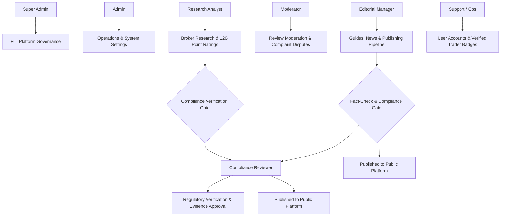

# REVIEW-SITE ADMIN — UI/UX WIREFRAME & PRODUCT DESIGN SPECIFICATION
**Product:** Review-Site (WikiFX / Financial Research Operations Console)  
**Document Version:** 1.0.0 — Production-Ready Master Specification  
**Architecture Classification:** Research Operations + Editorial CMS + Moderation Console + Compliance Workspace + Platform Administration  
**Author:** Senior Product Designer, UX Architect & Financial UI Specialist  

---

## 1. EXECUTIVE SUMMARY & PLATFORM PURPOSE

The **Review-Site Admin (Research Operations Console)** is the mission-critical operational and verification backbone supporting an independent financial research, broker comparison, and regulatory inquiry platform.

Unlike generic SaaS administrative panels, this console is architected around a strict fiduciary design principle:

$$\text{Evidence} \longrightarrow \text{Verification} \longrightarrow \text{Editorial Decision} \longrightarrow \text{Audited Publication}$$

No critical public-facing financial claim—including regulatory status, license numbers, fee benchmarks, 120-point rating pillars, or safety warnings—can be modified or published without an immutable evidence-backed verification workflow.

---

## 2. ROLE-BASED ACCESS CONTROL (RBAC) & USER PERSONAS

The Admin UI dynamically adapts to 7 distinct institutional operational roles:

| Role | Key Focus & Primary Responsibilities | Default Dashboard View | Module Access Scope |
| :--- | :--- | :--- | :--- |
| **Super Admin** | Platform-wide governance, user roles, system configs, emergency kill-switches, full audit logs | System & Platform Health | Full Access (All 18 modules) |
| **Admin** | Operational management, job queues, data imports, outbound tracking, category taxonomy | Operations & Queue Health | All modules except Root Security |
| **Research Analyst** | Broker profile research, live account spread testing, regulatory register lookup, rating calculations | Research Queue & Broker Updates | Research, Regulation, Evidence, Ratings, Data Quality |
| **Compliance Reviewer** | Regulatory license validation, evidence verification, risk disclosures, dispute oversight | Regulatory & Evidence Queues | Regulation, Evidence, Ratings (Review Gate), Complaints, Audit |
| **Moderator** | Trader review validation, complaint arbitration, fraud/scam report triage, broker replies | Community Moderation Queue | User Reviews, Complaints, Trader Reports, Evidence |
| **Editorial Manager** | Guides, market research, educational content, fact-checking, publication scheduling | Editorial Publishing Pipeline | Editorial CMS, Guides, News, Categories, Publishing Queue |
| **Support / Ops** | User accounts, verified trader badge validation, inquiries, platform operational tickets | Support & User Operations | Users, Directory, Notifications, Job Monitors |



---

## 3. INFORMATION ARCHITECTURE & SITEMAP

The operational navigation hierarchy is organized into 9 primary operational pillars comprising 18 canonical screens:

```text
ADMIN CONSOLE
│
├── 01. Dashboard (/dashboard)
│   ├── Research Operations Status
│   ├── Moderation & Dispute Queues
│   ├── Editorial Publishing Runway
│   ├── Platform Data Health & Sync Status
│   └── Immutable Real-Time Audit Feed
│
├── 02. Research & Broker Operations (/brokers)
│   ├── Broker Directory & Filtering Workspace (/brokers)
│   ├── Broker Administration & 15-Tab Workspace (/brokers/:id)
│   ├── 120-Point Rating Calculation Studio (/ratings)
│   ├── Evidence Library & Digital Vault (/evidence)
│   └── Research & Verification Queue (/research/queue)
│
├── 03. Regulation & Compliance (/regulation)
│   ├── Regulatory Verification Queue (/regulation/verification)
│   ├── Global Regulators Registry (/regulation/regulators)
│   ├── Regulator Detail & Scheme Rules (/regulation/regulators/:id)
│   └── Statutory Compensation Schemes (/regulation/schemes)
│
├── 04. Community & Moderation (/reviews & /complaints)
│   ├── Trader Review Moderation Queue (/reviews)
│   ├── Review Detail & Proof Inspection (/reviews/:id)
│   ├── Complaint & Dispute Arbitration (/complaints)
│   └── Dispute Detail & Settlement Workspace (/complaints/:id)
│
├── 05. Editorial CMS (/editorial)
│   ├── Guides & Educational Library (/editorial/guides)
│   ├── Guide Editor & Structured Content (/editorial/guides/:id)
│   ├── Market News & Research Dispatches (/editorial/news)
│   └── Publishing Approval Pipeline (/editorial/queue)
│
├── 06. Users & Identity (/users)
│   ├── User Directory & Trader Verification (/users)
│   ├── User Profile & Activity Record (/users/:id)
│   └── Roles & Permission Matrix (/roles)
│
├── 07. Analytics & Market Intelligence (/analytics)
│   ├── Research & Discovery Analytics
│   ├── Conversion & Outbound Affiliate Monitoring
│   ├── Tool Usage & Comparison Matrices
│   └── Community Trust & Dispute Metrics
│
├── 08. Data Quality & Platform Health (/data-quality & /operations)
│   ├── Automated Data Quality & Stale Alerts (/data-quality)
│   ├── System Operations & Background Job Queues (/operations)
│   └── Live API & Data Sync Monitors (/operations/sync)
│
└── 09. Platform Governance (/audit-logs & /settings)
    ├── Notification Center & Priority Alerts (/notifications)
    ├── Immutable Audit Log Console (/audit-logs)
    └── Global Platform & Legal Settings (/settings)
```

---

## 4. GLOBAL OPERATIONAL LAYOUT & UX PATTERNS

The application shell provides high data density, keyboard accessibility, and immediate contextual awareness:

```text
┌────────────────────────────────────────────────────────────────────────────────────────────────────────┐
│ [WikiFX OPS]  │ 🔍 Global Multi-Entity Search (Ctrl+K) │ ⚡ Role: [Research Analyst ▾] │ 🔔 (4) │ 👤 Admin │
├───────────────┬────────────────────────────────────────────────────────────────────────────────────────┤
│ ☰ NAVIGATION  │ Breadcrumbs: Research > Brokers > IC Markets (ID: BRK-001) > Ratings                   │
│               ├────────────────────────────────────────────────────────────────────────────────────────┤
│ 📊 Dashboard  │ PAGE HEADER: IC Markets — 120-Point Rating Calculation Studio                          │
│ 🏢 Brokers    │ Status: [Verified • Published] | Last Audit: 16 Sep 2026 by Elena Rostova               │
│ ⚖️ Regulation │ [Draft Preview]  [Compare Revisions]  [Attach Evidence]  [Submit for Compliance Review]│
│ 🛡️ Evidence   ├────────────────────────────────────────────────────────────────────────────────────────┤
│ ⭐ Ratings    │ WORKSPACE / DATA TABLE / SPLIT-PANE                                                    │
│ 💬 Reviews    │ ┌──────────────────────────────────────┬─────────────────────────────────────────────┐ │
│ ⚠️ Complaints │ │ Pillar 1: Safety & Regulation (30%)  │ Evidence Attached: [REG-2026-00481.pdf]     │ │
│ ✍️ Editorial  │ │ Score: 28.5 / 30 (+1.5 Delta)        │ Source: FCA Official Register (583261)       │ │
│ 👥 Users      │ │ • Tier-1 Licenses: 3 (FCA, ASIC)     │ Hash: e8f2...91b0 | Verified: Elena R.      │ │
│ 📈 Analytics  │ │ • Negative Balance Protection: Yes   │ Notes: Direct register snapshot verified    │ │
│ 🧹 Data Quality│ ├──────────────────────────────────────┼─────────────────────────────────────────────┤ │
│ ⚙️ Operations │ │ Pillar 2: Trading Costs & Spreads    │ Live Spread Benchmark: 0.1 p EUR/USD        │ │
│ 📜 Audit Logs │ │ Score: 24.0 / 25                     │ Commission: $3.50/lot ($7.00 round turn)    │ │
│ ⚙️ Settings   │ └──────────────────────────────────────┴─────────────────────────────────────────────┘ │
└───────────────┴────────────────────────────────────────────────────────────────────────────────────────┘
```

### Core Design Primitives:
1. **Collapsible High-Density Sidebar:** Icon + Badge counts for pending reviews/verifications.
2. **Global Multi-Entity Search (Ctrl+K):** Searches across brokers, regulators, license numbers, evidence IDs, review IDs, and articles with type tags.
3. **Role Switcher & Context Banner:** Instant switching between Super Admin, Analyst, Compliance, Moderator, and Editorial personas with simulated permission gating.
4. **Interactive Audit Timeline:** Real-time visual tracking of who modified what, when, why, and what evidence was linked.
5. **Unsaved Changes Shield:** Intercepts route navigation when dirty forms are open to prevent accidental loss of operational research.

---

## 5. CORE INTERACTIVE WORKFLOWS

### Workflow A: Regulatory License Verification
```text
Verification Queue (/regulation/verification)
  │
  ├── Select Pending Item: "VTIndex — ASIC 482910"
  ├── Inspect Official Register Screenshot & Source Link
  ├── Compare Legal Entity Name with Australian Companies Registry
  ├── Add Analyst Verification Notes & Confidence Score
  ├── Click [Verify & Stamp License]
  └── Emits Immutable Audit Entry (AUD-2026-XXXX) & Updates Broker Trust Score
```

### Workflow B: 120-Point Rating Calculation & Approval
```text
Broker Administration (/brokers/ic-markets/ratings)
  │
  ├── Adjust Pillar Stepper (e.g. Safety Pillar +1.5 pts)
  ├── System auto-calculates total 120-point score & 5.0-star equivalent
  ├── System displays visual Score Delta (+1.5 pts / +0.1 ★)
  ├── Mandatory: Attach Evidence ID (e.g. REG-2026-00481) and provide Rationale
  ├── Click [Submit for Compliance Approval]
  ├── Compliance Reviewer inspects diff & clicks [Approve & Publish]
  └── Public Broker Score syncs immediately
```

### Workflow C: Trader Review & Trade Statement Moderation
```text
Review Moderation Queue (/reviews)
  │
  ├── Filter by [High Risk] or [Evidence Attached]
  ├── Open Review #REV-4819 (User alleges 40-pip slippage on news event)
  ├── Inspect attached MT5 Statement CSV and Order Ticket
  ├── Check Broker Response (Threaded separately, never merged into claim)
  ├── Choose Moderation Action: [Approve as Verified Trader Review] / [Request Clarification] / [Reject Fraudulent]
  └── System triggers Trader Notification & Updates Aggregate Community Score
```

### Workflow D: Dispute & Formal Complaint Arbitration
```text
Complaint Management (/complaints/:id)
  │
  ├── Open Case #CMP-2026-089 (Claim: $14,500 Delayed Withdrawal)
  ├── Inspect Deposit/Withdrawal Proof, Bank Wire Receipts, and Ticket History
  ├── Send Official Formal Inquiry to Broker Compliance Contact
  ├── Record Broker Response: "Withdrawal processed after AML KYC refresh"
  ├── Change Case Status: [Broker Responded] → [Evidence Verified] → [Resolved/Closed]
  └── Public Complaint Counter on Broker Review page updates transparently
```

### Workflow E: Editorial Guide Fact-Checking & Publishing
```text
Editorial CMS (/editorial/guides/:id)
  │
  ├── Draft Guide: "Top ECN Forex Brokers with Raw Spreads (2026 Guide)"
  ├── Link Verified Brokers & Live Spread Data Blocks
  ├── Add Primary Sources and Regulatory Citations
  ├── Submit to Fact-Check Stage → Compliance Review Sign-off
  ├── Set Scheduled Publication Date & Canonical SEO Slug
  └── Click [Publish Guide]
```

---

## 6. COLOR SEMANTICS & STATUS ENUMS

| Status / Concept | Background / Border | Text Color | Semantic Meaning |
| :--- | :--- | :--- | :--- |
| **Verified / Active / Approved** | `bg-emerald-950/60 border-emerald-800` | `text-emerald-300` | Regulator register confirmed; evidence audited |
| **Pending / Under Review** | `bg-amber-950/60 border-amber-800` | `text-amber-300` | Awaiting compliance sign-off or evidence upload |
| **Draft / In Progress** | `bg-slate-900 border-slate-700` | `text-slate-300` | Research draft; not yet visible on public site |
| **Rejected / High Risk / Scam** | `bg-rose-950/60 border-rose-800` | `text-rose-300` | License revoked, clone firm, or moderation failure |
| **Expired / Stale** | `bg-orange-950/60 border-orange-800` | `text-orange-300` | Audit expired (>90 days); re-verification mandatory |
| **Tier-1 Jurisdiction** | `bg-blue-950/60 border-blue-800` | `text-blue-300` | FCA (UK), ASIC (AU), BaFin (DE), CFTC (US) |
| **Tier-2 Jurisdiction** | `bg-indigo-950/60 border-indigo-800` | `text-indigo-300` | CySEC (CY), FSCA (ZA), DFSA (AE) |
| **Tier-3 / Offshore** | `bg-purple-950/60 border-purple-800` | `text-purple-300` | FSA (SC), FSC (MU), VFSC (VU), BVI |

---

## 7. DATA DENSITY & ACCESSIBILITY

- **Font Family:** `Inter Variable`, tabular numbers (`font-mono`) for spreads, license numbers, timestamps, and ratings.
- **High-Density Data Grids:** 36px row heights with alternating subtle backgrounds and sticky header columns.
- **Keyboard Shortcuts:** `Ctrl+K` (Global Search), `Alt+S` (Save Draft), `Alt+V` (Verify), `Esc` (Close Drawers/Modals).
- **Audit Logging Guarantee:** Every data mutation records `{ timestamp, actorId, role, entity, entityId, beforeState, afterState, evidenceId, justification }`.
