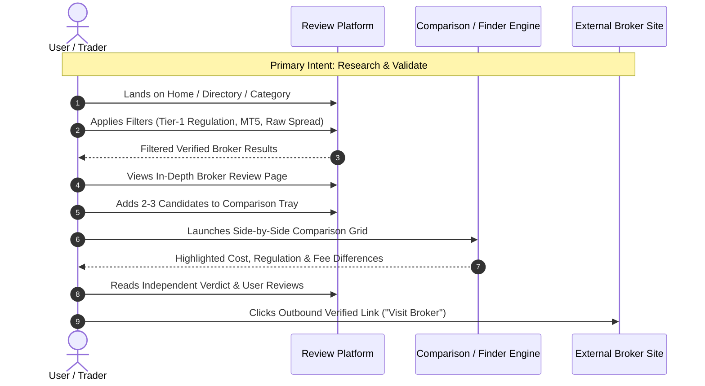
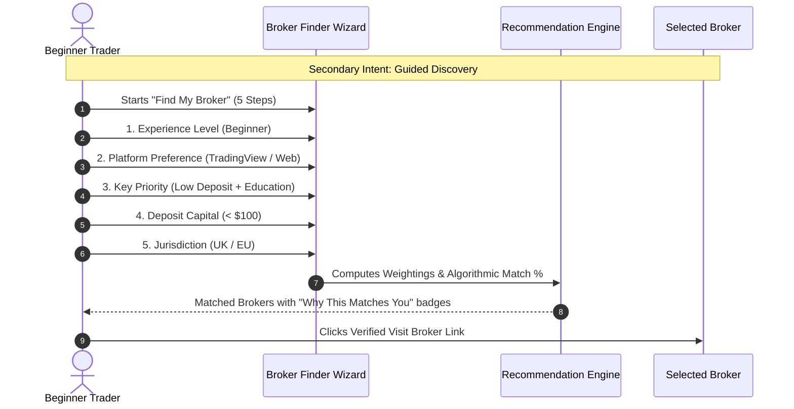

# Forex Broker Review, Comparison & Discovery Platform
## Comprehensive Low-to-Mid Fidelity Wireframe System & UX Architecture

---

## 1. Information Architecture & Sitemap

```mermaid
flowchart TD
    Home["HOME (/)"]
    
    %% Main Branches
    Brokers["BROKERS (/brokers)"]
    Compare["COMPARE (/compare)"]
    BestBrokers["BEST BROKERS (/best-brokers)"]
    Reviews["REVIEWS (/reviews)"]
    Regulation["REGULATION (/regulation)"]
    Guides["GUIDES (/guides)"]
    Tools["TOOLS (/tools)"]
    
    Home --> Brokers
    Home --> Compare
    Home --> BestBrokers
    Home --> Reviews
    Home --> Regulation
    Home --> Guides
    Home --> Tools
    
    %% Brokers Subpages
    Brokers --> B_All["All Brokers Directory (/brokers)"]
    Brokers --> B_Detail["Broker Review Template (/brokers/:slug)"]
    
    %% Compare Subpages
    Compare --> C_Builder["Comparison Builder (/compare)"]
    Compare --> C_Versus["Broker vs Broker Direct (/compare/:brokerA-vs-:brokerB)"]
    
    %% Best Brokers Subpages
    BestBrokers --> BB_Overall["Best Overall (/best-brokers/overall)"]
    BestBrokers --> BB_Beginners["Best for Beginners (/best-brokers/beginners)"]
    BestBrokers --> BB_Spreads["Best for Low Spreads (/best-brokers/low-spreads)"]
    BestBrokers --> BB_Scalping["Best for Scalping (/best-brokers/scalping)"]
    BestBrokers --> BB_MT4["Best MT4 Brokers (/best-brokers/mt4)"]
    BestBrokers --> BB_MT5["Best MT5 Brokers (/best-brokers/mt5)"]
    BestBrokers --> BB_TV["Best TradingView Brokers (/best-brokers/tradingview)"]
    
    %% Reviews Subpages
    Reviews --> R_All["Directory Reviews (/reviews)"]
    Reviews --> R_User["User Community Reviews (/reviews/community)"]
    Reviews --> R_Methodology["Editorial Rating Methodology (/how-we-rate)"]
    
    %% Regulation Subpages
    Regulation --> Reg_Hub["Regulation Hub (/regulation)"]
    Regulation --> Reg_FCA["FCA Regulated (/regulation/fca)"]
    Regulation --> Reg_ASIC["ASIC Regulated (/regulation/asic)"]
    Regulation --> Reg_CySEC["CySEC Regulated (/regulation/cysec)"]
    Regulation --> Reg_Guides["Verification Guides (/regulation/how-to-verify)"]
    
    %% Guides Subpages
    Guides --> G_Basics["Forex Basics (/guides/basics)"]
    Guides --> G_Costs["Trading Costs & Spreads (/guides/costs)"]
    Guides --> G_Platforms["Platforms & Software (/guides/platforms)"]
    Guides --> G_Risk["Risk & Leverage (/guides/risk-management)"]
    
    %% Tools Subpages
    Tools --> T_Finder["Broker Finder Wizard (/tools/broker-finder)"]
    Tools --> T_CostCalc["Forex Cost Calculator (/tools/cost-calculator)"]
    Tools --> T_PipCalc["Pip & Margin Calculator (/tools/pip-calculator)"]
```



---

## 2. User Journey Mapping





---

## 3. Global Navigation & Layout Architecture

### 3.1 Desktop Header & Mega Menu Wireframe

```text
┌──────────────────────────────────────────────────────────────────────────────────────────────────────────────────┐
│ [LOGO] FOREXRESEARCH.ORG    [Search brokers, regulators, platforms... 🔍]               [Find My Broker CTA]     │
├──────────────────────────────────────────────────────────────────────────────────────────────────────────────────┤
│  BROKERS ▾    COMPARE ▾    BEST BROKERS ▾    REVIEWS ▾    REGULATION ▾    GUIDES ▾    TOOLS ▾   [Affiliate Discl.] │
└──────────────────────────────────────────────────────────────────────────────────────────────────────────────────┘

MEGA MENU OPEN STATE (Example: "BROKERS ▾" or "BEST BROKERS ▾"):
┌──────────────────────────────────────────────────────────────────────────────────────────────────────────────────┐
│ POPULAR CATEGORIES             BY PLATFORM                BY TRADING STYLE             INDEPENDENT TOOLS         │
│ • Best Overall Brokers (2026)  • MetaTrader 4 (MT4)       • Day Trading & Scalping     • 🎯 Broker Finder Tool   │
│ • Best for Beginners           • MetaTrader 5 (MT5)       • ECN / Raw Spread           • 🧮 Trading Cost Calc    │
│ • Lowest Spread Accounts       • TradingView Integrated   • Copy & Social Trading      • 📐 Pip & Margin Calc    │
│ • Zero Minimum Deposit         • cTrader Brokers          • Algorithmic / API Trading  • 🛡️ License Verifier     │
│ • Islamic / Swap-Free          • Proprietary Web Apps     • High Leverage Options      ───────────────────────── │
│ ─────────────────────────────  ─────────────────────────  ───────────────────────────  [★ How We Rate Brokers]   │
│ [Browse All 140+ Brokers →]    [View Platform Matrix →]   [Compare Spreads Matrix →]   [Editorial Integrity →]   │
└──────────────────────────────────────────────────────────────────────────────────────────────────────────────────┘
```

### 3.2 Mobile Header & Navigation Drawer

```text
┌──────────────────────────────────────────────────┐
│ [☰ Menu]     [LOGO] FOREXRESEARCH        [🔍]    │
└──────────────────────────────────────────────────┘

MOBILE DRAWER STATE (Full-Height Sliding Sheet):
┌──────────────────────────────────────────────────┐
│ [✕ Close]  FOREX RESEARCH        [Find Broker 🎯]│
├──────────────────────────────────────────────────┤
│ 🔍 [ Search broker name...                     ] │
├──────────────────────────────────────────────────┤
│ ▾ Brokers Directory                              │
│   ├ All Verified Brokers                         │
│   ├ ECN Brokers                                  │
│   └ Zero Spread Accounts                         │
│ ▾ Best Brokers                                   │
│   ├ Top 10 Overall 2026                          │
│   ├ Best for Beginners                           │
│   ├ Best for Low Spreads                         │
│   └ Best MT4 / MT5                               │
│ ▸ Compare Brokers (Side-by-Side)                 │
│ ▸ Regulation & Safety Hub (FCA, ASIC, CySEC)     │
│ ▸ Trading Guides & Education                     │
│ ▸ Interactive Calculators                        │
├──────────────────────────────────────────────────┤
│ 🛡️ Independent Verification Standard             │
│ ℹ️ Advertiser Disclosure & Methodology           │
└──────────────────────────────────────────────────┘
```

---

## 4. Screen 01 — Homepage Wireframe

```text
┌──────────────────────────────────────────────────────────────────────────────────────────────────────────────────┐
│ [HEADER: Logo | Navigation Mega-Menus | Global Search Input | "Find My Broker" CTA]                             │
├──────────────────────────────────────────────────────────────────────────────────────────────────────────────────┤
│ HERO RESEARCH SECTION                                                                                            │
│                                                                                                                  │
│   [ INDEPENDENT FOREX RESEARCH & VERIFICATION PLATFORM ]                                                        │
│   Find the Safest, Lowest-Cost Broker for Your Trading Style                                                    │
│   Objective reviews, audited spread data, and regulatory verification across 150+ international brokers.        │
│                                                                                                                  │
│   ┌────────────────────────────────────────────────────────────────────────┬───────────────────────────────────┐ │
│   │ 🔍 Search by broker name, license number, or feature...               │ [ Search Directory ]              │ │
│   └────────────────────────────────────────────────────────────────────────┴───────────────────────────────────┘ │
│                                                                                                                  │
│   Quick Filter Shortcuts:                                                                                        │
│   [ 🛡️ FCA Regulated ]  [ ⚡ Raw ECN Spreads ]  [ 📊 TradingView ]  [ 🔰 $0 Min Deposit ]  [ 🤖 Scalping / EA ]   │
│                                                                                                                  │
│   ┌───────────────────────────────────────────────────────────────────────────────────────────────────────────┐ │
│   │ 🎯 Unsure which broker suits you?  Take our 60-Second Guided Finder Wizard.      [ Launch Broker Finder → ]│ │
│   └───────────────────────────────────────────────────────────────────────────────────────────────────────────┘ │
├──────────────────────────────────────────────────────────────────────────────────────────────────────────────────┤
│ EDITORIAL SPOTLIGHT: TOP RATED BROKERS 2026                                                                      │
│                                                                                                                  │
│ ┌───────────────────────┐ ┌───────────────────────┐ ┌───────────────────────┐ ┌───────────────────────┐          │
│ │ [Broker Logo]         │ │ [Broker Logo]         │ │ [Broker Logo]         │ │ [Broker Logo]         │          │
│ │ Broker A              │ │ Broker B              │ │ Broker C              │ │ Broker D              │          │
│ │ ★ 4.9/5 (Editor Score)│ │ ★ 4.8/5 (Editor Score)│ │ ★ 4.7/5 (Editor Score)│ │ ★ 4.7/5 (Editor Score)│          │
│ │ 🛡️ FCA, ASIC, CySEC  │ │ 🛡️ ASIC, CySEC, FSA  │ │ 🛡️ FCA, BaFin        │ │ 🛡️ ASIC, SCB         │          │
│ ├───────────────────────┤ ├───────────────────────┤ ├───────────────────────┤ ├───────────────────────┤          │
│ │ EUR/USD Spread: 0.1 p │ │ EUR/USD Spread: 0.6 p │ │ EUR/USD Spread: 0.0 p │ │ EUR/USD Spread: 0.8 p │          │
│ │ Min Deposit: $0       │ │ Min Deposit: $50      │ │ Min Deposit: $200     │ │ Min Deposit: $5       │          │
│ │ Platforms: MT4, MT5,TV│ │ Platforms: cTrader,MT4│ │ Platforms: MT5, Propri│ │ Platforms: MT4, MT5    │          │
│ ├───────────────────────┤ ├───────────────────────┤ ├───────────────────────┤ ├───────────────────────┤          │
│ │ "Best Overall 2026"   │ │ "Lowest ECN Spreads"  │ │ "Best for Beginners"  │ │ "Best Cent Accounts"  │          │
│ ├───────────────────────┤ ├───────────────────────┤ ├───────────────────────┤ ├───────────────────────┤          │
│ │ [ Read Full Review ]  │ │ [ Read Full Review ]  │ │ [ Read Full Review ]  │ │ [ Read Full Review ]  │          │
│ │ [ Visit Broker ↗ ]    │ │ [ Visit Broker ↗ ]    │ │ [ Visit Broker ↗ ]    │ │ [ Visit Broker ↗ ]    │          │
│ └───────────────────────┘ └───────────────────────┘ └───────────────────────┘ └───────────────────────┘          │
├──────────────────────────────────────────────────────────────────────────────────────────────────────────────────┤
│ EXPLORE BY CATEGORY TABS                                                                                         │
│ [ All Categories ] [ Beginners ] [ Low Spreads ] [ MT4/MT5 ] [ Copy Trading ] [ High Leverage ]                  │
│                                                                                                                  │
│ ┌──────────────────────────────────────────────────────────────────────────────────────────────────────────────┐ │
│ │ #1 Broker A  | ★ 4.9 | Reg: FCA, ASIC | EUR/USD: 0.1 p | Min: $0   | [Compare +] [Review] [Visit Broker ↗]   │ │
│ │ #2 Broker B  | ★ 4.8 | Reg: ASIC      | EUR/USD: 0.0 p | Min: $100 | [Compare +] [Review] [Visit Broker ↗]   │ │
│ │ #3 Broker C  | ★ 4.7 | Reg: FCA, CySEC| EUR/USD: 0.7 p | Min: $50  | [Compare +] [Review] [Visit Broker ↗]   │ │
│ └──────────────────────────────────────────────────────────────────────────────────────────────────────────────┘ │
├──────────────────────────────────────────────────────────────────────────────────────────────────────────────────┤
│ INTERACTIVE COMPARISON PREVIEW                                                                                   │
│                                                                                                                  │
│ ┌──────────────────────────────────────────────────────────────┬──────────────────────────────────────────────┐  │
│ │ Quick 1-vs-1 Head-to-Head Comparison                         │ Popular Showdowns:                           │  │
│ │                                                              │ • Broker A vs Broker B [View Comparison →]   │  │
│ │ [ Select Broker 1 ▾ ]   VS   [ Select Broker 2 ▾ ]           │ • Broker C vs Broker D [View Comparison →]   │  │
│ │                                                              │ • Broker A vs Broker C [View Comparison →]   │  │
│ │            [ Launch Side-by-Side Comparison → ]              │                                              │  │
│ └──────────────────────────────────────────────────────────────┴──────────────────────────────────────────────┘  │
├──────────────────────────────────────────────────────────────────────────────────────────────────────────────────┤
│ WHY TRUST OUR RESEARCH: THE INDEPENDENT EVALUATION FRAMEWORK                                                     │
│                                                                                                                  │
│ ┌─────────────────────────┐ ┌─────────────────────────┐ ┌─────────────────────────┐ ┌─────────────────────────┐│
│ │ 🛡️ Tier-1 Regulation    │ │ 🔬 Live Account Testing │ │ 💸 Audited Real Spreads │ │ ⚖️ 100% Unbiased Verdict││
│ │ Direct API license      │ │ We open live accounts & │ │ We measure real-time    │ │ Rankings cannot be      ││
│ │ verification with FCA,  │ │ test deposits, orders,  │ │ slippage & swap rates,  │ │ bought. Editorial score ││
│ │ ASIC, CySEC registries. │ │ and withdrawal times.   │ │ not marketing claims.   │ │ is strictly independent.││
│ └─────────────────────────┘ └─────────────────────────┘ └─────────────────────────┘ └─────────────────────────┘│
├──────────────────────────────────────────────────────────────────────────────────────────────────────────────────┤
│ LATEST RESEARCH, REVIEWS & EDUCATIONAL GUIDES                                                                    │
│                                                                                                                  │
│ ┌───────────────────────────────┐ ┌───────────────────────────────┐ ┌───────────────────────────────────────────┐│
│ │ [Article Thumbnail]           │ │ [Article Thumbnail]           │ │ 🧮 Interactive Financial Tools         ││
│ │ How to Spot an Unregulated    │ │ ECN vs STP vs Market Maker:   │ │ • Forex All-in Spread Calculator      ││
│ │ Offshore Scam Broker in 2026  │ │ Which Execution Model Wins?   │ │ • Live Pip Value & Risk Estimator     ││
│ │ By Lead Analyst | 6 min read  │ │ By Senior Editor | 8 min read │ │ • Broker License Registry Lookup      ││
│ │ [Read Guide →]                │ │ [Read Guide →]                │ │ [Explore All Trading Tools →]         ││
│ └───────────────────────────────┘ └───────────────────────────────┘ └───────────────────────────────────────────┘│
├──────────────────────────────────────────────────────────────────────────────────────────────────────────────────┤
│ [FOOTER: Detailed Directory Links | Regulatory Disclosures | Methodology | Contact | Risk Warning]             │
└──────────────────────────────────────────────────────────────────────────────────────────────────────────────────┘
```

---

## 5. Screen 02 — Broker Directory (Search & Faceted Discovery)

```text
┌──────────────────────────────────────────────────────────────────────────────────────────────────────────────────┐
│ Breadcrumbs: Home > Brokers > Directory                                                                          │
│                                                                                                                  │
│ Forex & CFD Broker Directory                                                                                     │
│ Discover and filter 142 independently audited and verified brokers based on your exact trading criteria.         │
│                                                                                                                  │
│ ┌──────────────────────────────────────────────────────────────────────────────────────────┬───────────────────┐ │
│ │ 🔍 Filter by broker name, feature, or regulatory license number...                       │ [ Search ]        │ │
│ └──────────────────────────────────────────────────────────────────────────────────────────┴───────────────────┘ │
│ Active Filters: [ FCA Regulated ✕ ] [ EUR/USD Spread < 1.0 p ✕ ] [ MT5 ✕ ]                [ Clear All Filters ]  │
├──────────────────────────────┬───────────────────────────────────────────────────────────────────────────────────┤
│ FACETED FILTER SIDEBAR (Desktop)│ SORT: [ Highest Rated ▾ ]  Showing 1–15 of 42 Matched Brokers  [ Table | Cards ] │
│                              ├───────────────────────────────────────────────────────────────────────────────────┤
│ ▾ Regulation Tier            │ ┌───────────────────────────────────────────────────────────────────────────────┐ │
│   [x] Tier-1 (FCA, ASIC, CySEC)│ │ [LOGO]  Broker A                                 ★ 4.9/5 (1,240 Reviews)    │ │
│   [ ] Tier-2 (DFSA, FSCA)    │ │         FCA (#583261), ASIC, CySEC                 Verified Active License 🛡️ │ │
│   [ ] Tier-3 (FSC, VFSC)     │ ├───────────────────────────────────────────────────────────────────────────────┤ │
│                              │ │ Min Deposit: $0        | Avg Spread (EUR/USD): 0.1 p | Max Leverage: 1:30 (EU) │ │
│ ▾ Platforms                  │ │ Platforms: MT4, MT5, TV| Execution: Raw ECN/STP      | Swap-Free: Available   │ │
│   [ ] MetaTrader 4 (MT4)     │ ├───────────────────────────────────────────────────────────────────────────────┤ │
│   [x] MetaTrader 5 (MT5)     │ │ Editorial Verdict: Exceptional low spreads and top-tier FCA security.         │ │
│   [ ] TradingView            │ ├───────────────────────────────────────────────────────────────────────────────┤ │
│   [ ] cTrader                │ │ [ + Add to Compare ]      [ 📖 Read Full Review ]       [ 🚀 Visit Broker ↗ ] │ │
│   [ ] WebTrader Proprietary  │ └───────────────────────────────────────────────────────────────────────────────┘ │
│                              │ ┌───────────────────────────────────────────────────────────────────────────────┐ │
│ ▾ Minimum Deposit            │ │ [LOGO]  Broker B                                 ★ 4.8/5 (890 Reviews)      │ │
│   (o) Any                    │ │         ASIC (#443670), CySEC                      Verified Active License 🛡️ │ │
│   ( ) $0 – $50               │ ├───────────────────────────────────────────────────────────────────────────────┤ │
│   ( ) $50 – $200             │ │ Min Deposit: $100      | Avg Spread (EUR/USD): 0.0 p | Max Leverage: 1:500     │ │
│   ( ) $200+                  │ │ Platforms: cTrader, MT4| Execution: True ECN         | Commission: $3.00/lot  │ │
│                              │ ├───────────────────────────────────────────────────────────────────────────────┤ │
│ ▾ Spread Type                │ │ Editorial Verdict: Benchmark ECN execution designed for scalpers and algo.    │ │
│   [x] Raw / Zero Spread (<0.5)│ ├───────────────────────────────────────────────────────────────────────────────┤ │
│   [ ] Standard (No Comm.)    │ │ [ + Add to Compare ]      [ 📖 Read Full Review ]       [ 🚀 Visit Broker ↗ ] │ │
│   [ ] Fixed Spread           │ └───────────────────────────────────────────────────────────────────────────────┘ │
│                              │ ┌───────────────────────────────────────────────────────────────────────────────┐ │
│ ▾ Trading Style & Features   │ │ [LOGO]  Broker C                                 ★ 4.7/5 (2,100 Reviews)    │ │
│   [ ] Scalping Allowed       │ │         FCA (#198762), BaFin                       Verified Active License 🛡️ │ │
│   [ ] Expert Advisors (EA)   │ ├───────────────────────────────────────────────────────────────────────────────┤ │
│   [ ] Copy Trading           │ │ Min Deposit: $20       | Avg Spread (EUR/USD): 0.7 p | Max Leverage: 1:30      │ │
│   [ ] Negative Balance Prot. │ │ Platforms: Proprietary | Execution: Market Maker/STP | Commission: $0.00      │ │
│                              │ ├───────────────────────────────────────────────────────────────────────────────┤ │
│ ▾ Funding Methods            │ │ Editorial Verdict: Industry-leading beginner academy and award-winning app.   │ │
│   [ ] Credit/Debit Card      │ ├───────────────────────────────────────────────────────────────────────────────┤ │
│   [ ] Bank Wire              │ │ [ + Add to Compare ]      [ 📖 Read Full Review ]       [ 🚀 Visit Broker ↗ ] │ │
│   [ ] PayPal / Skrill / Net  │ └───────────────────────────────────────────────────────────────────────────────┘ │
│   [ ] Crypto Funding         │                                                                                   │
│                              │  PAGINATION:  [ « Prev ]  [ 1 ]  [ 2 ]  [ 3 ]  [ 4 ]  ...  [ 10 ]  [ Next » ]    │
└──────────────────────────────┴───────────────────────────────────────────────────────────────────────────────────┘

STICKY COMPARISON TRAY (Appears bottom of screen when 1+ brokers are checked):
┌──────────────────────────────────────────────────────────────────────────────────────────────────────────────────┐
│ ⚖️ Comparison Tray (2/4 selected):  [ Broker A ✕ ]  [ Broker B ✕ ]  [ + Add Broker ]   [ Compare Now (2) → ]     │
└──────────────────────────────────────────────────────────────────────────────────────────────────────────────────┘
```

---

## 6. Screen 03 — Broker Review (Detailed Evaluation Template)

```text
┌──────────────────────────────────────────────────────────────────────────────────────────────────────────────────┐
│ Breadcrumbs: Home > Brokers > Broker A Review                                                                    │
├──────────────────────────────────────────────────────────────────────────────────────────────────────────────────┤
│ ABOVE THE FOLD: BROKER SUMMARY & VERIFICATION BADGE                                                             │
│                                                                                                                  │
│ ┌─────────────────────────┬─────────────────────────────────────────────────┬──────────────────────────────────┐ │
│ │ [ BROKER LOGO ]         │ Broker A In-Depth Review                        │ Overall Editorial Score          │ │
│ │                         │ Regulated by: FCA (UK), ASIC (AU), CySEC (CY)   │   ★★★★★  4.8 / 5.0              │ │
│ │ Founded: 2007           │ Primary License: FCA Ref #583261 [Audited ✓]    │   Class: "Exceptional / Safe"    │ │
│ │ HQ: London, UK          │ Operational Status: Verified Active             │   User Rating: ★ 4.6 (1,420 rev.)│ │
│ │ Parent: Group Ltd       │ Last Fact-Checked: September 2026               │                                  │ │
│ │                         │                                                 │ [ 🚀 Open Verified Account ↗ ]   │ │
│ │ [ ⚖️ Add to Comparison ]│ [ 🛡️ 100% Verified Regulation ] [ 💸 Audited Fees ]│ (74% of retail CFD accounts lose)│ │
│ └─────────────────────────┴─────────────────────────────────────────────────┴──────────────────────────────────┘ │
├──────────────────────────────────────────────────────────────────────────────────────────────────────────────────┤
│ QUICK SPECS MATRIX                                                                                               │
│ ┌──────────────────┬──────────────────┬──────────────────┬──────────────────┬──────────────────┬───────────────┐ │
│ │ Min. Deposit     │ EUR/USD Spread   │ Commission       │ Max Leverage     │ Platforms        │ Tradable Mkts │ │
│ │ $0 (No minimum)  │ 0.1 pips (Raw)   │ $3.00 / side     │ 1:30 (UK) / 1:500│ MT4, MT5, cTrade │ 2,100+ CFDs   │ │
│ └──────────────────┴──────────────────┴──────────────────┴──────────────────┴──────────────────┴───────────────┘ │
├──────────────────────────────────────────────────────┬───────────────────────────────────────────────────────────┤
│ IN-PAGE NAVIGATION (Sticky Under Header):            │ STICKY SIDEBAR (Desktop 3–4 Cols)                         │
│ [Overview] [Regulation] [Costs] [Platforms] [Reviews]│ ┌───────────────────────────────────────────────────────┐ │
│                                                      │ │ BROKER A AT A GLANCE                                  │ │
│ EDITORIAL VERDICT (Our Independent Assessment)       │ │ Overall Score: ★ 4.8 / 5.0                            │ │
│ ┌──────────────────────────────────────────────────┐ │ │ Regulation: Tier-1 (FCA, ASIC)                        │ │
│ │ "Broker A represents the gold standard for active│ │ │ Min Deposit: $0                                       │ │
│ │ retail traders requiring institutional-grade     │ │ │ EUR/USD Spread: 0.1 p                                 │ │
│ │ liquidity, ultra-low raw spreads from 0.0 pips,  │ │ │ Commission: $3.00/lot                                 │ │
│ │ and tier-1 regulatory security. While its client │ │ ├───────────────────────────────────────────────────────┤ │
│ │ onboarding is thorough, educational materials for│ │ │ [ 🚀 Visit Broker Website ↗ ]                         │ │
│ │ absolute beginners are somewhat limited."        │ │ │ [ ⚖️ Compare with Competitors ]                       │ │
│ ├─────────────────────────┬────────────────────────┤ │ ├───────────────────────────────────────────────────────┤ │
│ │ ✅ BEST FOR             │ ❌ NOT IDEAL FOR       │ │ │ Quick Calculator:                                     │ │
│ │ • Scalpers & Algo/EAs   │ • Total beginners      │ │ │ 1 Lot EUR/USD = $7.00 Round-turn                      │ │
│ │ • Low-spread intraday   │ • Fixed-spread seekers │ │ └───────────────────────────────────────────────────────┘ │
│ │ • High-volume CFD traders│ • USA resident traders│ └───────────────────────────────────────────────────────────┘
│ └─────────────────────────┴────────────────────────┘                                                             │
│                                                                                                                  │
│ PROS & CONS                                                                                                      │
│ ┌──────────────────────────────────────────────────┬───────────────────────────────────────────────────────────┐ │
│ │ 👍 PROS                                          │ 👎 CONS                                                   │ │
│ │ • Ultra-tight EUR/USD spreads averaging 0.1 pips │ • Inactivity fee applied after 12 months dormancy         │ │
│ │ • Triple Tier-1 regulation (FCA, ASIC, CySEC)    │ • Customer phone support not 24/7 on weekends             │ │
│ │ • Supports MT4, MT5, cTrader, and TradingView    │ • Does not accept US clients (CFTC regulations)           │ │
│ │ • Fast execution speeds (<35ms average fill)     │ • Standard account spreads are higher than ECN account    │ │
│ └──────────────────────────────────────────────────┴───────────────────────────────────────────────────────────┘ │
│                                                                                                                  │
│ RATING BREAKDOWN (Editorial Weighted Score)                                                                      │
│ ┌──────────────────────────────────────────────────────────────────────────────────────────────────────────────┐ │
│ │ Safety & Regulation (30%)    ████████████████████████████████████████  5.0 / 5.0  (3 Tier-1 Licenses)        │ │
│ │ Trading Costs & Fees (25%)   ████████████████████████████████████░░░░  4.7 / 5.0  (0.1 pip + $3 commission)  │ │
│ │ Platforms & Tools (20%)      ████████████████████████████████████████  5.0 / 5.0  (MT4, MT5, cTrader, API)   │ │
│ │ Deposit & Withdrawal (10%)   ████████████████████████████████░░░░░░░░  4.5 / 5.0  (0% fee, fast processing)  │ │
│ │ Customer Support (15%)       ████████████████████████████████░░░░░░░░  4.4 / 5.0  (Live chat response < 1m)  │ │
│ └──────────────────────────────────────────────────────────────────────────────────────────────────────────────┘ │
│                                                                                                                  │
│ DETAILED EVALUATION SECTIONS                                                                                     │
│                                                                                                                  │
│ 1.0 REGULATION & SAFETY AUDIT                                                                                    │
│ ┌──────────────────────┬──────────────────────┬────────────────────────┬───────────────────────────────────────┐ │
│ │ Regulatory Body      │ Country / Region     │ License / Entity Name  │ Verification Status                   │ │
│ ├──────────────────────┼──────────────────────┼────────────────────────┼───────────────────────────────────────┤ │
│ │ FCA (UK)             │ United Kingdom       │ #583261 (Broker UK Ltd)│ [✓ Verified Active on FCA Register]   │ │
│ │ ASIC (Australia)     │ Australia            │ #443670 (Broker AU Pty)│ [✓ Verified Active on ASIC Register]  │ │
│ │ CySEC (Cyprus/EU)    │ European Union       │ #188/13 (Broker EU Ltd)│ [✓ Verified Active on CySEC Register] │ │
│ └──────────────────────┴──────────────────────┴────────────────────────┴───────────────────────────────────────┘ │
│ • Client Fund Segregation: Tier-1 Banks (Barclays, NAB)                                                          │
│ • Negative Balance Protection: Yes (Mandatory for retail under FCA/ESMA)                                         │
│ • Compensation Fund: FSCS up to £85,000 (UK) / ICF up to €20,000 (EU)                                            │
│                                                                                                                  │
│ 2.0 TRADING COSTS, SPREADS & COMMISSIONS (Audited Real-Time Data)                                                │
│ ┌──────────────────────┬──────────────────────┬────────────────────────┬───────────────────────────────────────┐ │
│ │ Asset / Pair         │ Raw ECN Spread       │ Standard Spread        │ Commission (Round Turn)               │ │
│ ├──────────────────────┼──────────────────────┼────────────────────────┼───────────────────────────────────────┤ │
│ │ EUR / USD            │ 0.1 pips             │ 0.9 pips               │ $6.00 per lot ($3 per side)           │ │
│ │ GBP / USD            │ 0.3 pips             │ 1.2 pips               │ $6.00 per lot                         │ │
│ │ USD / JPY            │ 0.2 pips             │ 1.0 pips               │ $6.00 per lot                         │ │
│ │ XAU / USD (Gold)     │ 0.12 pips            │ 0.25 pips              │ $6.00 per lot                         │ │
│ └──────────────────────┴──────────────────────┴────────────────────────┴───────────────────────────────────────┘ │
│ • Overnight Swap Rates: Benchmarked at competitive institutional interbank swap rates.                           │
│ • Inactivity Fee: $10/month after 365 days of dormancy. No deposit or withdrawal fees.                           │
│                                                                                                                  │
│ 3.0 TRADING PLATFORMS & EXECUTION                                                                                │
│ • Supported: MetaTrader 4 (Desktop/Mobile), MetaTrader 5, cTrader Suite, TradingView Charting Integration        │
│ • Execution Type: No Dealing Desk (NDD) / True ECN with Equinix NY4 & LD4 cross-connects                         │
│ • Execution Speed: 32ms Average Fill Time | Slippage: Positive/Neutral 94% of audited orders                     │
│                                                                                                                  │
│ 4.0 ACCOUNT TYPES COMPARISON                                                                                     │
│ ┌──────────────────────┬───────────────────────────────┬───────────────────────────────────────────────────────┐ │
│ │ Account Feature      │ Raw Spread Account (ECN)      │ Standard Account                                      │ │
│ ├──────────────────────┼───────────────────────────────┼───────────────────────────────────────────────────────┤ │
│ │ Min Deposit          │ $0                            │ $0                                                    │ │
│ │ Spread From          │ 0.0 pips                      │ 0.8 pips                                              │ │
│ │ Commission           │ $3.00 / 100k traded           │ $0.00 (Mark-up included in spread)                    │ │
│ │ Best Suited For      │ Scalpers, Day Traders, EAs    │ Casual traders, swing traders                         │ │
│ └──────────────────────┴───────────────────────────────┴───────────────────────────────────────────────────────┘ │
│                                                                                                                  │
│ 5.0 VERIFIED USER REVIEWS (4.6 / 5.0 based on 1,420 Reviews)                                                     │
│ ┌──────────────────────────────────────────────────────────────────────────────────────────────────────────────┐ │
│ │ [★ 5/5] "Best ECN execution for EUR/USD algo trading" — John D. (UK, Verified Account) | 12 Aug 2026        │ │
│ │ "Withdrawal of $4,200 processed to my UK bank account in 4 hours. Spreads are truly near zero on NY open."  │ │
│ ├──────────────────────────────────────────────────────────────────────────────────────────────────────────────┤ │
│ │ [★ 4/5] "Great platform, but weekend support is chat-bot only" — Maria S. (Germany) | 28 Jul 2026            │ │
│ └──────────────────────────────────────────────────────────────────────────────────────────────────────────────┘ │
│                                                                                                                  │
│ 6.0 FREQUENTLY ASKED QUESTIONS (Accordion Component)                                                            │
│ [▼] Is Broker A safe and legitimate?                                                                             │
│     Yes. Broker A is authorized and regulated by the UK Financial Conduct Authority (FCA #583261) and ASIC.    │
│ [►] What is the minimum deposit for Broker A?                                                                    │
│ [►] How does Broker A make money on Raw ECN accounts?                                                            │
│ [►] Can US citizens open an account with Broker A?                                                               │
│                                                                                                                  │
│ 7.0 SIMILAR ALTERNATIVE BROKERS TO CONSIDER                                                                      │
│ ┌─────────────────────────────┐ ┌─────────────────────────────┐ ┌──────────────────────────────────────────────┐ │
│ │ [Logo] Broker B             │ │ [Logo] Broker C             │ │ [Logo] Broker D                              │ │
│ │ Match: 96% Similarity       │ │ Match: 92% Similarity       │ │ Match: 88% Similarity                        │ │
│ │ Why: Lower cTrader commission│ │ Why: Better beginner guides │ │ Why: Higher non-EU leverage                  │ │
│ │ [ Compare Broker A vs B → ] │ │ [ Compare Broker A vs C → ] │ │ [ Compare Broker A vs D → ]                  │ │
│ └─────────────────────────────┘ └─────────────────────────────┘ └──────────────────────────────────────────────┘ │
├──────────────────────────────────────────────────────────────────────────────────────────────────────────────────┤
│ FINAL EDITORIAL SUMMARY & RECOMMENDATION                                                                         │
│ ┌──────────────────────────────────────────────────────────────────────────────────────────────────────────────┐ │
│ │ Rating: ★ 4.8 / 5.0  |  Verdict: Highly Recommended for Low Cost & Safety                                   │ │
│ │ [ 🚀 Open Live Account with Broker A ↗ ]                   [ ⚖️ Add Broker A to Comparison Table ]             │ │
│ └──────────────────────────────────────────────────────────────────────────────────────────────────────────────┘ │
└──────────────────────────────────────────────────────────────────────────────────────────────────────────────────┘
```

---

## 7. Screen 04 — Comparison Builder (Side-by-Side Evaluation)

```text
┌──────────────────────────────────────────────────────────────────────────────────────────────────────────────────┐
│ Breadcrumbs: Home > Compare > Multi-Broker Comparison Tool                                                       │
│                                                                                                                  │
│ Side-by-Side Forex Broker Comparison                                                                             │
│ Compare spreads, regulatory safety, platforms, fees, and execution conditions across up to 4 brokers.            │
│                                                                                                                  │
│ Controls:  [x] Highlight Differences Only   [ ] Show Identical Rows   |  [ + Add Another Broker (2/4 used) ]     │
├────────────────────────┬──────────────────────────┬──────────────────────────┬───────────────────────────────────┤
│ COMPARISON CATEGORY    │ [LOGO] BROKER A          │ [LOGO] BROKER B          │ [ + ADD BROKER 3 ]                │
│                        │ ★ 4.8/5 (Editor Score)   │ ★ 4.7/5 (Editor Score)   │ [ Search to add... ▾ ]            │
│                        │ [ Visit Broker ↗ ]       │ [ Visit Broker ↗ ]       │                                   │
├────────────────────────┼──────────────────────────┼──────────────────────────┼───────────────────────────────────┤
│ 🛡️ REGULATION & TRUST  │                          │                          │                                   │
│ Primary Regulators     │ FCA (UK), ASIC, CySEC    │ ASIC (AU), CySEC, FSA    │ —                                 │
│ Tier-1 Regulation      │ 3 Licenses [HIGH]        │ 2 Licenses [HIGH]        │ —                                 │
│ Client Segregation     │ Yes (Tier-1 Banks)       │ Yes (Tier-1 Banks)       │ —                                 │
│ Negative Balance Prot. │ Yes                      │ Yes                      │ —                                 │
│ Trust Score            │ 99 / 100                 │ 94 / 100                 │ —                                 │
├────────────────────────┼──────────────────────────┼──────────────────────────┼───────────────────────────────────┤
│ 💸 TRADING COSTS       │                          │                          │                                   │
│ EUR/USD Avg Spread     │ 0.1 pips [LOWER]         │ 0.6 pips                 │ —                                 │
│ GBP/USD Avg Spread     │ 0.3 pips [LOWER]         │ 0.9 pips                 │ —                                 │
│ Commission (Per Lot)   │ $3.00 per side ($6 RT)   │ $0.00 (Mark-up) [NO COMM]│ —                                 │
│ All-In Cost (EUR/USD)  │ 0.7 pips equivalent      │ 0.6 pips equivalent      │ —                                 │
│ Inactivity Fee         │ $10/mo after 12 mos      │ $0 (No inactivity fee)   │ —                                 │
├────────────────────────┼──────────────────────────┼──────────────────────────┼───────────────────────────────────┤
│ ⚙️ ACCOUNT & DEPOSITS  │                          │                          │                                   │
│ Minimum Deposit        │ $0                       │ $50                      │ —                                 │
│ Max Leverage (Retail)  │ 1:30 (FCA) / 1:500 (Pro) │ 1:30 (ASIC) / 1:500 (FSA)│ —                                 │
│ Account Currencies     │ USD, EUR, GBP, AUD, JPY  │ USD, EUR, GBP            │ —                                 │
│ Deposit Methods        │ Card, Wire, PayPal, Skril│ Card, Wire, Crypto, Skril│ —                                 │
│ Withdrawal Speed       │ Instant – 24 hours       │ 24 – 48 hours            │ —                                 │
├────────────────────────┼──────────────────────────┼──────────────────────────┼───────────────────────────────────┤
│ 💻 TRADING PLATFORMS   │                          │                          │                                   │
│ MetaTrader 4 (MT4)     │ Yes                      │ Yes                      │ —                                 │
│ MetaTrader 5 (MT5)     │ Yes                      │ Yes                      │ —                                 │
│ TradingView Integration│ Yes [AVAILABLE]          │ No                       │ —                                 │
│ cTrader                │ Yes [AVAILABLE]          │ No                       │ —                                 │
│ Proprietary Mobile App │ Yes (iOS / Android)      │ Yes (iOS / Android)      │ —                                 │
├────────────────────────┼──────────────────────────┼──────────────────────────┼───────────────────────────────────┤
│ 📊 MARKETS & ASSETS    │                          │                          │                                   │
│ Forex Pairs            │ 64 pairs                 │ 55 pairs                 │ —                                 │
│ Indices / Commodities  │ 25 indices / 20 comm.    │ 18 indices / 15 comm.    │ —                                 │
│ Crypto CFDs            │ 30 coins                 │ 15 coins                 │ —                                 │
│ Share CFDs             │ 2,000+ shares            │ 500+ shares              │ —                                 │
├────────────────────────┼──────────────────────────┼──────────────────────────┼───────────────────────────────────┤
│ 🏆 SUMMARY VERDICT     │                          │                          │                                   │
│ Winner For...          │ Best for Low Spreads & TV│ Best for Beginners & Zero│                                   │
│ Full Review Link       │ [ Read Broker A Review ] │ [ Read Broker B Review ] │ —                                 │
│ Outbound Link          │ [ 🚀 Visit Broker A ↗ ]  │ [ 🚀 Visit Broker B ↗ ]  │ —                                 │
└────────────────────────┴──────────────────────────┴──────────────────────────┴───────────────────────────────────┘
```

---

## 8. Screen 05 — Broker Finder (5-Step Guided Matching Engine)

```text
┌──────────────────────────────────────────────────────────────────────────────────────────────────────────────────┐
│ Breadcrumbs: Home > Tools > Broker Finder Wizard                                                                 │
├──────────────────────────────────────────────────────────────────────────────────────────────────────────────────┤
│ 🎯 GUIDED BROKER FINDER WIZARD                                                                                   │
│ Answer 5 quick questions to get personalized, unbiased broker recommendations matching your strategy.           │
│                                                                                                                  │
│ Progress:  [Step 1: Experience] ──●── [Step 2: Platform] ──○── [Step 3: Priorities] ──○── [Step 4] ──○── [Step 5]│
├──────────────────────────────────────────────────────────────────────────────────────────────────────────────────┤
│ STEP 1 OF 5: What is your primary trading style and experience level?                                            │
│                                                                                                                  │
│ ┌──────────────────────────────────────┐ ┌──────────────────────────────────────┐                                │
│ │ ( ) 🔰 Beginner / Learning           │ │ (•) ⚡ Scalper / High-Frequency Day  │                                │
│ │ Focus: Education, Demo, Simple Apps  │ │ Focus: Ultra-tight spreads, fast NDD │  [SELECTED]                     │
│ └──────────────────────────────────────┘ └──────────────────────────────────────┘                                │
│ ┌──────────────────────────────────────┐ ┌──────────────────────────────────────┐                                │
│ │ ( ) 📈 Swing / Position Trader       │ │ ( ) 🤖 Algorithmic / EA / Automated  │                                │
│ │ Focus: Overnight swap rates, charts  │ │ Focus: VPS hosting, API, MT4/MT5/cTra│                                │
│ └──────────────────────────────────────┘ └──────────────────────────────────────┘                                │
│ ┌──────────────────────────────────────┐                                                                        │
│ │ ( ) 👥 Copy / Social Trader          │                                                                        │
│ │ Focus: Verified master leaderboards  │                                                                        │
│ └──────────────────────────────────────┘                                                                        │
├──────────────────────────────────────────────────────────────────────────────────────────────────────────────────┤
│ [ « Back ]                                                                                   [ Continue to Step 2 »]│
└──────────────────────────────────────────────────────────────────────────────────────────────────────────────────┘

FINDER RESULTS PAGE:
┌──────────────────────────────────────────────────────────────────────────────────────────────────────────────────┐
│ 🎯 YOUR PERSONALIZED BROKER MATCHES (3 Brokers Found)                                                            │
│ Based on: Scalper | MT5 & TradingView | Raw Spreads Priority | $500 Deposit | United Kingdom                     │
├──────────────────────────────────────────────────────────────────────────────────────────────────────────────────┤
│ ┌──────────────────────────────────────────────────────────────────────────────────────────────────────────────┐ │
│ │ 🏆 TOP MATCH: 96% COMPATIBILITY                                                                              │ │
│ │ [LOGO] Broker A                                                      Overall Score: ★ 4.8 / 5.0 (FCA #583261)│ │
│ ├──────────────────────────────────────────────────────────────────────────────────────────────────────────────┤ │
│ │ WHY THIS BROKER MATCHES YOUR PROFILE:                                                                        │ │
│ │   ✓ Raw ECN Spreads: Averaging 0.1 pips on EUR/USD (Matches your scalping requirement)                       │ │
│ │   ✓ Platforms: Full native support for MT5 and TradingView webhook integration                              │ │
│ │   ✓ Ultra-Low Latency: Equinix LD4 execution under 35ms                                                      │ │
│ │   ✓ UK Resident Friendly: Authorized and regulated by the UK Financial Conduct Authority (FCA)              │ │
│ ├──────────────────────────────────────────────────────────────────────────────────────────────────────────────┤ │
│ │ Min Deposit: $0  |  EUR/USD Spread: 0.1 p  |  Commission: $3.00/lot  |  Leverage: 1:30 (FCA)                  │ │
│ ├──────────────────────────────────────────────────────────────────────────────────────────────────────────────┤ │
│ │ [ 📖 Read Full Review ]       [ ⚖️ Add to Compare ]               [ 🚀 Visit Broker Website ↗ ]              │ │
│ └──────────────────────────────────────────────────────────────────────────────────────────────────────────────┘ │
│ ┌──────────────────────────────────────────────────────────────────────────────────────────────────────────────┐ │
│ │ 🥈 RUNNER UP: 91% COMPATIBILITY                                                                              │ │
│ │ [LOGO] Broker B                                                      Overall Score: ★ 4.7 / 5.0 (ASIC/CySEC) │ │
│ ├──────────────────────────────────────────────────────────────────────────────────────────────────────────────┤ │
│ │ WHY THIS MATCHES:                                                                                            │ │
│ │   ✓ True ECN cTrader execution model with $3.00 commissions                                                  │ │
│ │   ✓ Free VPS hosting for accounts maintaining over $1,000 balance                                            │ │
│ ├──────────────────────────────────────────────────────────────────────────────────────────────────────────────┤ │
│ │ [ 📖 Read Full Review ]       [ ⚖️ Add to Compare ]               [ 🚀 Visit Broker Website ↗ ]              │ │
│ └──────────────────────────────────────────────────────────────────────────────────────────────────────────────┘ │
│ [ ⟲ Retake Finder Quiz ]                                                          [ View All 140+ Brokers Directory ]│
└──────────────────────────────────────────────────────────────────────────────────────────────────────────────────┘
```

---

## 9. Screen 06 — Best Brokers Category (e.g., Best for Beginners)

```text
┌──────────────────────────────────────────────────────────────────────────────────────────────────────────────────┐
│ Breadcrumbs: Home > Best Brokers > Best Forex Brokers for Beginners (2026)                                       │
├──────────────────────────────────────────────────────────────────────────────────────────────────────────────────┤
│ Best Forex Brokers for Beginners (2026 Edition)                                                                  │
│ Evaluated on user interface simplicity, demo account usability, low minimum deposits, and educational quality.  │
│                                                                                                                  │
│ Fact-Checked by Editorial Team | Updated: September 2026 | [ ℹ️ How We Choose & Rate Beginners Brokers ]        │
├──────────────────────────────────────────────────────────────────────────────────────────────────────────────────┤
│ EDITORIAL SELECTION CRITERIA                                                                                     │
│ Every broker on this list must meet 4 mandatory baseline requirements:                                           │
│ 1. Tier-1 Regulatory License (FCA, ASIC, or CySEC) with Negative Balance Protection                              │
│ 2. Minimum deposit under $100 (or $0)                                                                            │
│ 3. Free, unlimited demo trading account                                                                          │
│ 4. Structured video/text beginner curriculum with zero upsell pressure                                          │
├──────────────────────────────────────────────────────────────────────────────────────────────────────────────────┤
│ RANKED EDITORIAL RECOMMENDATIONS                                                                                 │
│                                                                                                                  │
│ ┌──────────────────────────────────────────────────────────────────────────────────────────────────────────────┐ │
│ │ RANK #1: BEST OVERALL FOR BEGINNERS                                                                          │ │
│ │ [LOGO] Broker C                                                 ★ 4.8 / 5.0  |  FCA, ASIC, CySEC Regulated   │ │
│ ├──────────────────────────────────────────────────────────────────────────────────────────────────────────────┤ │
│ │ Key Specs: Min Deposit: $10 | Standard Spread: 0.8 p (No Comm.) | Platform: Custom Web & Mobile App          │ │
│ ├──────────────────────────────────────────────────────────────────────────────────────────────────────────────┤ │
│ │ Why Selected for Beginners:                                                                                  │ │
│ │ • Award-winning proprietary mobile app with integrated risk-management calculators and stop-loss warnings.   │ │
│ │ • Interactive 40-lesson beginner trading course with quiz checkpoints and simulated paper-trading.           │ │
│ │ • 24/5 dedicated phone support with immediate human agent connection.                                        │ │
│ ├──────────────────────────────────────┬───────────────────────────────────────────────────────────────────────┤ │
│ │ 👍 PROS: Intuitive app; $10 deposit   │ 👎 CONS: Higher spreads than dedicated ECN accounts (0.8 p vs 0.1 p)  │ │
│ ├──────────────────────────────────────┴───────────────────────────────────────────────────────────────────────┤ │
│ │ [ ⚖️ Compare ]                       [ 📖 Read Comprehensive Review ]             [ 🚀 Visit Broker C ↗ ]   │ │
│ └──────────────────────────────────────────────────────────────────────────────────────────────────────────────┘ │
│                                                                                                                  │
│ ┌──────────────────────────────────────────────────────────────────────────────────────────────────────────────┐ │
│ │ RANK #2: BEST FOR SOCIAL & COPY TRADING BEGINNERS                                                            │ │
│ │ [LOGO] Broker E                                                 ★ 4.6 / 5.0  |  FCA, CySEC Regulated         │ │
│ ├──────────────────────────────────────────────────────────────────────────────────────────────────────────────┤ │
│ │ Key Specs: Min Deposit: $50 | Spread: 1.0 p | Feature: 1-Click Copy Trader Portfolios                        │ │
│ ├──────────────────────────────────────────────────────────────────────────────────────────────────────────────┤ │
│ │ [ ⚖️ Compare ]                       [ 📖 Read Comprehensive Review ]             [ 🚀 Visit Broker E ↗ ]   │ │
│ └──────────────────────────────────────────────────────────────────────────────────────────────────────────────┘ │
├──────────────────────────────────────────────────────────────────────────────────────────────────────────────────┤
│ BEGINNER FAQ ACCORDION                                                                                           │
│ [▼] How much money do I need to start trading forex as a beginner?                                               │
│ [►] Can I lose more money than I deposit with these brokers?                                                     │
│ [►] What is the difference between demo trading and live trading?                                                │
└──────────────────────────────────────────────────────────────────────────────────────────────────────────────────┘
```

---

## 10. Screen 07 — Regulation Hub & Regulator Guides

```text
┌──────────────────────────────────────────────────────────────────────────────────────────────────────────────────┐
│ Breadcrumbs: Home > Regulation & Safety Hub                                                                      │
├──────────────────────────────────────────────────────────────────────────────────────────────────────────────────┤
│ Forex Broker Regulation & Safety Hub                                                                             │
│ How regulatory protection works, registry verification guides, and independent tier rankings.                    │
├──────────────────────────────────────────────────────────────────────────────────────────────────────────────────┤
│ JURISDICTION TIER PYRAMID                                                                                        │
│                                                                                                                  │
│ ┌──────────────────────────────────────────────────────────────────────────────────────────────────────────────┐ │
│ │ 🛡️ TIER 1: STRICTEST PROTECTION (FCA UK, ASIC Australia, CySEC Cyprus/EU, BaFin Germany, FINMA Switz.)      │ │
│ │ • Segregated tier-1 client accounts • Negative balance protection • Statutory compensation schemes (£85k/€20k)│ │
│ │ • Maximum retail leverage caps (1:30) • Strict ban on trading bonuses/rebate inducements                    │ │
│ ├──────────────────────────────────────────────────────────────────────────────────────────────────────────────┤ │
│ │ ⚠️ TIER 2: MODERATE PROTECTION (DFSA Dubai, FSCA South Africa, MAS Singapore)                                │ │
│ │ • Audited financial reporting • Good dispute resolution • Varying compensation structures                     │ │
│ ├──────────────────────────────────────────────────────────────────────────────────────────────────────────────┤ │
│ │ ⛔ TIER 3 / OFFSHORE: MINIMAL PROTECTION (FSC Mauritius, VFSC Vanuatu, FSA Seychelles, SVG)                  │ │
│ │ • High leverage (1:500+) • No mandatory compensation • Higher risk of unresolvable disputes                   │ │
│ └──────────────────────────────────────────────────────────────────────────────────────────────────────────────┘ │
├──────────────────────────────────────────────────────────────────────────────────────────────────────────────────┤
│ HOW TO VERIFY A BROKER LICENSE (4-Step Safety Checklist)                                                         │
│                                                                                                                  │
│ [ Step 1: Find License No. ]  ──> [ Step 2: Open Official Register ] ──> [ Step 3: Match Domain ] ──> [ Step 4 ] │
│ Locate registration number in      Visit FCA/ASIC/CySEC register         Ensure URL precisely matches  Verify segregated│
│ broker footer (e.g. #583261)       directly (not via broker links)       approved entity website name  bank details     │
├──────────────────────────────────────────────────────────────────────────────────────────────────────────────────┤
│ REGULATOR BREAKDOWN CARDS                                                                                        │
│                                                                                                                  │
│ ┌─────────────────────────────┐ ┌─────────────────────────────┐ ┌──────────────────────────────────────────────┐ │
│ │ 🇬🇧 FCA (United Kingdom)     │ │ 🇦🇺 ASIC (Australia)         │ │ 🇨🇾 CySEC (Cyprus / EEA)                      │ │
│ │ Financial Conduct Authority │ │ Aus. Securities & Inv. Comm │ │ Cyprus Securities & Exchange                 │ │
│ │ • Compensation: Up to £85,000│ • Compensation: National AFCA│ │ • Compensation: Up to €20,000 (ICF)          │ │
│ │ • Leverage Limit: 1:30      │ │ • Leverage Limit: 1:30      │ │ • Leverage Limit: 1:30                       │ │
│ │ • Segregation: Mandatory    │ │ • Segregation: Mandatory    │ │ • Segregation: Mandatory                     │ │
│ │ [ Browse 48 FCA Brokers → ] │ │ [ Browse 36 ASIC Brokers → ]│ │ [ Browse 62 CySEC Brokers → ]                │ │
│ └─────────────────────────────┘ └─────────────────────────────┘ └──────────────────────────────────────────────┘ │
└──────────────────────────────────────────────────────────────────────────────────────────────────────────────────┘
```

---

## 11. Screen 08 — User Reviews Community & Submission

```text
┌──────────────────────────────────────────────────────────────────────────────────────────────────────────────────┐
│ Breadcrumbs: Home > Brokers > Broker A > User Reviews                                                            │
├──────────────────────────────────────────────────────────────────────────────────────────────────────────────────┤
│ Community Reviews: Broker A                                                                                      │
│ 1,420 Independent Trader Reviews & Ratings                                                                       │
│                                                                                                                  │
│ ┌───────────────────────────┬────────────────────────────────────────────────────┬─────────────────────────────┐ │
│ │ OVERALL USER SCORE        │ RATING DISTRIBUTION                                │ WRITE A REVIEW              │ │
│ │ ★★★★☆ 4.6 / 5.0          │ 5 Stars  ███████████████████████████████ (72%)     │ Have you traded with        │ │
│ │                           │ 4 Stars  ████████░░░░░░░░░░░░░░░░░░░░░░░ (18%)     │ Broker A? Share your honest │ │
│ │ 91% of reviewers would    │ 3 Stars  ██░░░░░░░░░░░░░░░░░░░░░░░░░░░░░ (5%)      │ execution/withdrawal review.│ │
│ │ recommend to a colleague  │ 2 Stars  █░░░░░░░░░░░░░░░░░░░░░░░░░░░░░░ (3%)      │                             │ │
│ │                           │ 1 Star   █░░░░░░░░░░░░░░░░░░░░░░░░░░░░░░ (2%)      │ [ ✍️ Submit User Review ]   │ │
│ └───────────────────────────┴────────────────────────────────────────────────────┴─────────────────────────────┘ │
├──────────────────────────────────────────────────────────────────────────────────────────────────────────────────┤
│ Filter Reviews:  [ All Ratings ▾ ]  [ Verified Traders Only (✓) ]  [ With Screenshots ]   Sort: [ Most Helpful ▾ ] │
├──────────────────────────────────────────────────────────────────────────────────────────────────────────────────┤
│ ┌──────────────────────────────────────────────────────────────────────────────────────────────────────────────┐ │
│ │ ★★★★★  "Fastest withdrawals I've experienced in 6 years of trading"                                          │ │
│ │ By Alex M. | 🇬🇧 United Kingdom | Experience: 5+ Years | Account: Raw ECN | [✓ Verified Live Account Trader] │ │
│ │ Date: August 14, 2026 | Platform: MT5 Desktop                                                                │ │
│ ├──────────────────────────────────────────────────────────────────────────────────────────────────────────────┤ │
│ │ Review:                                                                                                      │ │
│ │ Tested EUR/USD slippage across 450 trades during the London session. Execution speed was consistently under  │ │
│ │ 40ms. Requested a £7,800 bank transfer withdrawal on Tuesday at 9am, funds arrived in my account by 1pm.    │ │
│ ├──────────────────────────────────────────────────────────────────────────────────────────────────────────────┤ │
│ │ 👍 PROS: Instant card deposits, true zero spreads on majors | 👎 CONS: Weekend customer support queue        │ │
│ ├──────────────────────────────────────────────────────────────────────────────────────────────────────────────┤ │
│ │ Was this review helpful?  [ 👍 Helpful (42) ]  [ 👎 Report ]                                                  │ │
│ └──────────────────────────────────────────────────────────────────────────────────────────────────────────────┘ │
│                                                                                                                  │
│ REVIEW SUBMISSION MODAL STATE:                                                                                   │
│ ┌──────────────────────────────────────────────────────────────────────────────────────────────────────────────┐ │
│ │ ✍️ Submit an Independent Trader Review                                                      [ ✕ Close ]       │ │
│ ├──────────────────────────────────────────────────────────────────────────────────────────────────────────────┤ │
│ │ Overall Star Rating: [ ★ ] [ ★ ] [ ★ ] [ ★ ] [ ★ ]                                                           │ │
│ │ Detailed Criteria:  Execution Speed: [ 5/5 ▾ ]  Spreads & Fees: [ 4/5 ▾ ]  Customer Support: [ 4/5 ▾ ]       │ │
│ │ Review Headline: [ E.g., Fast execution, good spreads...                                                   ] │ │
│ │ Your Review Details: [ Minimum 100 characters detailing trading conditions, platform, withdrawals...      ] │ │
│ │ Pros: [ Key advantages...                        ]  Cons: [ Pain points or issues...                       ] │ │
│ │ Trader Experience: ( ) Beginner (<1 yr)  ( ) Intermediate (1-3 yrs)  (•) Advanced (3+ yrs)                  │ │
│ │ Proof of Trading (Optional for Verified Badge): [ Upload account statement / trade log screenshot ]          │ │
│ │ [x] I confirm this review reflects my genuine trading experience and I have no commercial affiliation.       │ │
│ │                                                                                       [ Submit Review → ]    │ │
│ └──────────────────────────────────────────────────────────────────────────────────────────────────────────────┘ │
└──────────────────────────────────────────────────────────────────────────────────────────────────────────────────┘
```

---

## 12. Screen 09 & 10 — Guides & Interactive Calculators

### Screen 09: Educational Guides & Editorial Hub
```text
┌──────────────────────────────────────────────────────────────────────────────────────────────────────────────────┐
│ Breadcrumbs: Home > Guides > Forex Trading Costs Explained                                                       │
├──────────────────────────────────────────────────────────────────────────────────────────────────────────────────┤
│ ARTICLE HEADER: Understanding All-In Forex Trading Costs: Spreads, Commissions & Swaps                           │
│ By David Vance, Head of Quantitative Research | Fact-Checked by Editorial Board | 8 min read | Sep 2026          │
├──────────────────────────────────────────────────────┬───────────────────────────────────────────────────────────┤
│ TABLE OF CONTENTS                                    │ ARTICLE BODY CONTENT                                      │
│ 1. The Real Cost of a Trade                          │                                                           │
│ 2. Spread Models: Fixed vs Floating vs Raw ECN       │ 1. The Real Cost of a Trade                               │
│ 3. Hidden Slippage & Execution Friction              │ When trading foreign exchange, costs are rarely just the  │
│ 4. Overnight Swap Financing Formulas                 │ advertised spread. Total friction = (Spread + Commission +│
│ 5. How to Calculate Total Cost Per Lot               │ Slippage + Swap Fees).                                    │
│ 6. Recommended Low-Cost Brokers                      │                                                           │
│                                                      │ ┌───────────────────────────────────────────────────────┐ │
│                                                      │ │ FORMULA: 1 Standard Lot (100,000 Units) Cost:         │ │
│                                                      │ │ Total Cost = (Spread in Pips × Pip Value) + Commission│ │
│                                                      │ └───────────────────────────────────────────────────────┘ │
│                                                      │                                                           │
│                                                      │ [Interactive Embedded Tool: Live Spread Calculator]       │
└──────────────────────────────────────────────────────┴───────────────────────────────────────────────────────────┘
```

### Screen 10: Financial Research Calculators Hub
```text
┌──────────────────────────────────────────────────────────────────────────────────────────────────────────────────┐
│ Breadcrumbs: Home > Tools > Forex Trading Calculators                                                            │
├──────────────────────────────────────────────────────────────────────────────────────────────────────────────────┤
│ 🧮 Interactive Trading Cost & Pip Calculators                                                                    │
├──────────────────────────────┬──────────────────────────────┬────────────────────────────────────────────────────┤
│ 🎯 Broker Finder Wizard      │ 💸 All-In Cost Calculator    │ 📐 Pip Value & Lot Size Calculator                 │
│ Match your style with the    │ Calculate total round-turn   │ Calculate exact monetary risk per pip across 60+   │
│ right verified broker in 5   │ fees per lot including       │ currency pairs, indices, and metals based on       │
│ guided steps.                │ commission and spread.       │ account base currency.                             │
│ [ Launch Broker Finder → ]   │ [ Launch Cost Calculator → ] │ [ Launch Pip Calculator → ]                        │
└──────────────────────────────┴──────────────────────────────┴────────────────────────────────────────────────────┘

CALCULATOR INTERFACE WIREFRAME (Forex Cost Calculator):
┌──────────────────────────────────────────────────────────────────────────────────────────────────────────────────┐
│ Currency Pair: [ EUR/USD ▾ ] | Account Base: [ USD ▾ ] | Trade Size: [ 1.00 Lot (100,000 units) ▾ ]              │
│ Broker Model: (•) Raw ECN (0.1 pip + $6 comm.)   ( ) Standard Account (0.9 pip + $0 comm.)                       │
├──────────────────────────────────────────────────────────────────────────────────────────────────────────────────┤
│ CALCULATED COST BREAKDOWN:                                                                                       │
│ • Spread Cost: $1.00 (0.1 pips × $10/pip)                                                                        │
│ • Commission Cost: $6.00 round-turn                                                                              │
│ • TOTAL TRANSACTION COST: $7.00 per standard lot                                                                 │
│ ──────────────────────────────────────────────────────────────────────────────────────────────────────────────── │
│ Compare with standard broker ($9.00/lot): You save $2.00 per lot traded.  [ View Lowest Spread Brokers → ]       │
└──────────────────────────────────────────────────────────────────────────────────────────────────────────────────┘
```

---

## 13. Global UI Component Architecture

```text
┌──────────────────────────────────────────────────────────────────────────────────────────────────────────────────┐
│ GLOBAL UI COMPONENT LIBRARY                                                                                      │
├──────────────────────────────────────────────────────────────────────────────────────────────────────────────────┤
│ 1.0 BROKER CARD (Standard Directory Variant)                                                                     │
│ ┌──────────────────────────────────────────────────────────────────────────────────────────────────────────────┐ │
│ │ [LOGO]  Broker Name                         Editor Score: ★ 4.8 / 5.0 | Regulation: [FCA] [ASIC] [CySEC]     │ │
│ ├──────────────────────────────────────────────────────────────────────────────────────────────────────────────┤ │
│ │ Min Deposit: $0  |  EUR/USD: 0.1 p  |  Commission: $3.00/lot  |  Platforms: MT4, MT5, TradingView           │ │
│ ├──────────────────────────────────────────────────────────────────────────────────────────────────────────────┤ │
│ │ Highlights: Ultra-tight spreads, instant FCA segregated withdrawals, Equinix NY4 servers.                     │ │
│ ├──────────────────────────────────────────────────────────────────────────────────────────────────────────────┤ │
│ │ [x] Compare   |   [ 📖 Read Full Review ]                          [ 🚀 Visit Broker Website ↗ ]             │ │
│ └──────────────────────────────────────────────────────────────────────────────────────────────────────────────┘ │
│                                                                                                                  │
│ 2.0 BADGES & TRUST INDICATORS                                                                                    │
│ [ 🛡️ FCA Regulated #583261 ]  [ ✓ Verified Live License ]  [ ⚡ Audited 0.1 p Spread ]  [ 🔒 Segregated Funds ]    │
│                                                                                                                  │
│ 3.0 PROGRESS BARS & SCORE GAUGES                                                                                 │
│ Regulation Score:  ████████████████████  10.0 / 10.0                                                             │
│ Cost Score:        ████████████████░░░░   8.8 / 10.0                                                             │
│ Platform Score:    ██████████████████░░   9.4 / 10.0                                                             │
│                                                                                                                  │
│ 4.0 ACCORDION COMPONENT                                                                                          │
│ ┌──────────────────────────────────────────────────────────────────────────────────────────────────────────────┐ │
│ │ [▼] How does the broker comparison tool calculate overall scores?                                            │ │
│ │     Our editorial score is calculated from 120+ data points across 6 weighted categories...                  │ │
│ └──────────────────────────────────────────────────────────────────────────────────────────────────────────────┘ │
│ ┌──────────────────────────────────────────────────────────────────────────────────────────────────────────────┐ │
│ │ [►] Are the spreads shown on this platform live or average?                                                  │ │
│ └──────────────────────────────────────────────────────────────────────────────────────────────────────────────┘ │
│                                                                                                                  │
│ 5.0 BUTTON & CTA SYSTEM                                                                                          │
│ [ Primary Solid CTA: "Visit Broker Website ↗" ]    [ Secondary Outline: "Read In-Depth Review" ]                 │
│ [ Action Ghost CTA: "+ Add to Comparison" ]        [ Wizard Accent CTA: "Find My Broker Now 🎯" ]                │
└──────────────────────────────────────────────────────────────────────────────────────────────────────────────────┘
```

---

## 14. Responsive Grid & Mobile Layout Architecture

### 14.1 12-Column Desktop Grid Hierarchy
- **Max Container Width**: 1240px
- **Columns**: 12 equal columns (68px col + 24px gutter)
- **Review Page Split**: 8 Columns (Main Content: 800px) + 4 Columns (Sticky Widget: 380px)
- **Directory Split**: 3 Columns (Filters: 280px) + 9 Columns (Cards/Table: 900px)

### 14.2 Mobile Single-Column Stack Architecture

```text
MOBILE VIEW: BROKER REVIEW SCREEN (< 768px)
┌──────────────────────────────────────────────────┐
│ [☰] FOREX RESEARCH                   [🔍] [🎯]   │
├──────────────────────────────────────────────────┤
│ Breadcrumb: Home > Brokers > Broker A            │
├──────────────────────────────────────────────────┤
│ [LOGO]  Broker A                                 │
│ ★★★★★ 4.8 / 5.0 (Editor Score)                   │
│ 🛡️ FCA, ASIC, CySEC Verified                      │
├──────────────────────────────────────────────────┤
│ [ 🚀 Open Verified Account ↗ ]                   │
│ (74% of retail CFD accounts lose money)          │
├──────────────────────────────────────────────────┤
│ QUICK METRICS (2x3 Grid):                        │
│ ┌──────────────────────┬───────────────────────┐ │
│ │ Min Deposit: $0      │ EUR/USD: 0.1 p        │ │
│ ├──────────────────────┼───────────────────────┤ │
│ │ Comm: $3.00/lot      │ Leverage: 1:30        │ │
│ ├──────────────────────┼───────────────────────┤ │
│ │ Platforms: MT4/5/TV  │ Markets: 2,100+       │ │
│ └──────────────────────┴───────────────────────┘ │
├──────────────────────────────────────────────────┤
│ EDITORIAL VERDICT ACCORDION                      │
│ [▼] Our Verdict & Ratings                        │
│     "Best broker for scalpers needing raw spreads│
│      and FCA-backed security."                   │
│     • Best For: EAs, intraday scalping           │
│     • Pros & Cons (Tap to view)                  │
├──────────────────────────────────────────────────┤
│ ACCORDION DEEP DIVES:                            │
│ [►] 1.0 Regulation & Safety Verification (FCA)   │
│ [►] 2.0 Audited Spreads & Fee Breakdown          │
│ [►] 3.0 Platforms (MT4, MT5, TradingView)        │
│ [►] 4.0 Account Types & Minimum Deposits         │
│ [►] 5.0 Verified User Reviews (1,420 Reviews)    │
│ [►] 6.0 Frequently Asked Questions               │
├──────────────────────────────────────────────────┤
│ MOBILE STICKY BOTTOM ACTION BAR:                 │
│ ┌──────────────────────────────────────────────┐ │
│ │ Broker A (★ 4.8)    [ 🚀 Visit Broker ↗ ]    │ │
│ └──────────────────────────────────────────────┘ │
└──────────────────────────────────────────────────┘
```

---

## 15. Trust & Transparency UX System

```text
┌──────────────────────────────────────────────────────────────────────────────────────────────────────────────────┐
│ TRUST & TRANSPARENCY ARCHITECTURE                                                                               │
├──────────────────────────────────────────────────────────────────────────────────────────────────────────────────┤
│ 1. MANDATORY ADVERTISER & AFFILIATE DISCLOSURE (Site-Wide Banner & Modal)                                        │
│ "Advertiser Disclosure: We are an independent financial research and comparison portal. When you open an        │
│ account using links on our platform, we may receive compensation from partners. However, this does not influence │
│ our editorial scoring, ranking algorithm, or fact-checked reviews. Brokers cannot pay for higher ratings."      │
│                                                                                                                  │
│ 2. FACT-CHECK & METHODOLOGY AUDIT STAMP (Present on every review and guide)                                     │
│ ┌──────────────────────────────────────────────────────────────────────────────────────────────────────────────┐ │
│ │ 🛡️ Fact-Checked & Verified by Editorial Board | Last Updated: September 2026                                 │ │
│ │ • License status confirmed on FCA Financial Services Register (Ref #583261)                                  │ │
│ │ • Real-money live test account active for spread verification                                                │ │
│ │ • [ Read Our 120-Point Rating Methodology → ]                                                               │ │
│ └──────────────────────────────────────────────────────────────────────────────────────────────────────────────┘ │
│                                                                                                                  │
│ 3. RISK WARNING NOTICE (Legally compliant financial disclosure)                                                  │
│ "CFDs are complex instruments and come with a high risk of losing money rapidly due to leverage. Between 70%    │
│ and 85% of retail investor accounts lose money when trading CFDs with these providers. You should consider       │
│ whether you understand how CFDs work and whether you can afford to take the high risk of losing your capital."  │
└──────────────────────────────────────────────────────────────────────────────────────────────────────────────────┘
```

---

## 16. Component State Specifications

| Component | Default State | Hover / Focus State | Active / Selected State | Loading / Empty State | Error State |
| :--- | :--- | :--- | :--- | :--- | :--- |
| **Comparison Checkbox** | `[ + Add to Compare ]` (Grey outline) | Highlight border + "Add Broker A" tooltip | `[ ✓ Added to Compare ]` (Filled primary) | Spinner if fetching specs | "Max 4 brokers reached" modal alert |
| **Filter Sidebar** | Unchecked checkboxes / Range sliders at default | Checkbox hover tint / Slider active knob | Filter badge count `(3 Active)`, active chip rendered | Skeleton pulse cards on result container | "No brokers match your filter criteria" + Reset CTA |
| **Broker Finder Step** | Radio cards unselected with subtle border | 2px border accent + slight scale-up | Radio card active with check icon and blue border | Calculating algorithm animation (1.2s delay) | Step required validation highlight if Next clicked |
| **Search Input** | Ghost placeholder text + Search icon | Active focus ring + Recent searches dropdown | Typeahead live suggestions (Broker name, license, tag) | Skeleton dropdown loader | "No broker found matching 'XYZ'" + Directory link |
| **User Review Form** | Empty form inputs + 0 filled stars | Star hover preview (1 to 5) | Form filled with verified trading statement attached | "Submitting review..." button spinner | Inline red error validation on missed fields |

---

## 17. UX Rationale & Design Decision Summary

1. **Independent Research Authority Feel**:
   - Styled with clean, content-first typography, structured data tables, and explicit regulatory verification badges. Avoids promotional banners, flashy neon buttons, or simulated trading charts that make sites look like affiliate spam or broker terminals.

2. **The "Review → Compare → Validate" Core Loop**:
   - The UX consistently supports non-linear exploration. Whether a user lands from Google on an individual review page, browses the directory, or completes the 5-step Finder Wizard, they are always 1 click away from adding candidates to the sticky comparison tray.

3. **Separation of Editorial Scores & User Reviews**:
   - The platform strictly separates the weighted editorial rating (based on verifiable data like tier-1 licenses, audited raw spreads, and withdrawal speed tests) from open community user reviews, eliminating fake-review manipulation.

4. **Contextual Mobile Ergonomics**:
   - Instead of cramming complex 14-column comparison tables onto mobile screens, the mobile experience converts comparisons into swipeable cards with category accordions and a sticky bottom CTA bar for effortless thumb-reach navigation.
